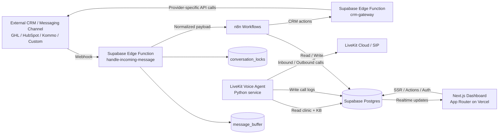
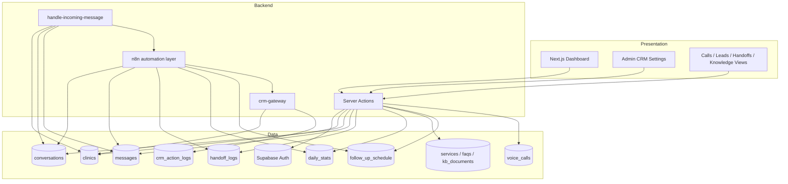
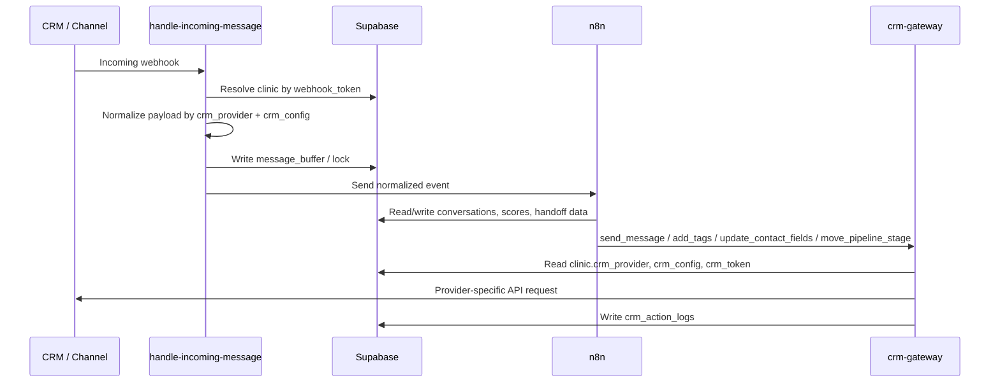
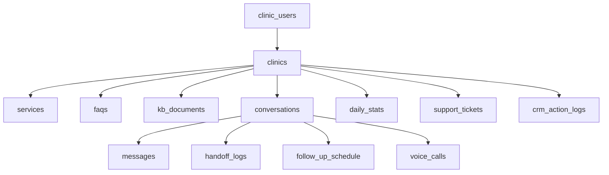
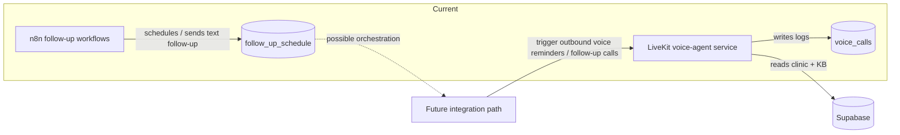

# STOAIX Current Architecture

Bu doküman projenin mevcut mimarisini görsel olarak özetler.

## 1. High-Level System

## 2. Application Layers

## 3. CRM Abstraction Flow

## 4. Dashboard Data Model

## 5. Voice + Follow-up Readiness

## 6. Current Flexibility Summary

- Panel ve tenant modeli güçlü; Supabase RLS ile iyi izole edilmiş.
- CRM katmanı artık doğrudan tek provider'a bağlı değil, `crm-gateway` üzerinden soyutlanmış.
- n8n akışları CRM gateway'i kullanıyor; bu iyi bir ayrım.
- Voice agent ayrı bir servis olarak hazır, ama ana follow-up orchestration'a tam bağlanmış değil.
- `custom` provider temel mesaj gönderme için uygun; derin CRM senaryosu için provider adapter gerekir.
